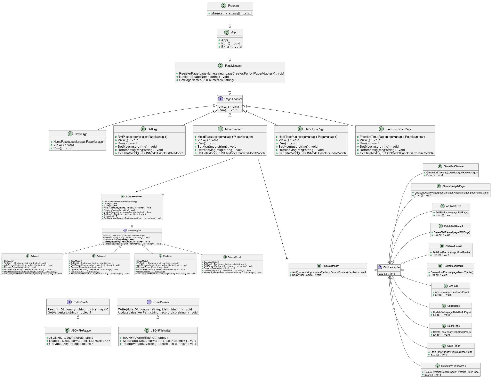

    

## Pulse – A Terminal-Based Personal Health Tracker

---

## 📌 About the Project
This project was created for the **OOP-2 Lab final submission**.

The objective of this project is to promote a healthy lifestyle by providing an easy to use console application for tracking various aspects of personal health and motivating users to maintain and improve their overall health and well being.

The project adheres to best practices in object-oriented programming (OOP) and follows the **SOLID principles** to ensure clean, modular, and maintainable code.

## ✨ Features
Pulse offers an **intuitive and beautiful terminal-based user interface** with the following features:

✅ A random motivational quote about **health and well-being** on the home page.\
✅ **Daily BMI calculator** and tracker.\
✅ **Daily mood and stress tracker** to log mental and emotional well-being.\
✅ **Healthy habit to-do tracker** to encourage positive lifestyle changes.\
✅ **Exercise timer and record tracker** for logging workouts.

---

## 🏗️ Design Principles Followed

This project follows **four out of the five** SOLID principles:

#### ✅ **Single Responsibility Principle (SRP)**
- Each class in the app is **responsible for only one specific task and one reason to change**, making the code **easier to understand, test and modify**.
- The app is divided into several data models, pages and function choices, each of them responsible for their own related tasks.

#### ✅ **Open/Closed Principle (OCP)**
- The code is **open for extension but closed for modification**.
- New features (e.g., adding new pages to the app or adding new options to page functions) can be added **without modifying** existing code.

#### ✅ **Interface Segregation Principle (ISP)**
- The app uses **specific, small interfaces** instead of large, bloated ones.
  -  Like `IPageAdapter`: Concerened about methods the app page should have
  -  `IModelAdapter`: Provides necessary methods a data model should have.
  -  and many more ...
- This ensures that each module **only depends on what it actually needs**.

#### ✅ **Dependency Inversion Principle (DIP)**
- The app depends on **abstractions rather than concrete implementations** by using proper abstraction layer between low-level logic implementations and high level client classes making it **more flexible and testable**.
- Instead of tightly coupling classes, dependencies are **injected through interfaces**.
- For example, each page class in the app implements `IPageAdapter` interface and a high level client class `PageManager` uses the the interface abstraction layer to manage the pages instead of concrete page class.

#### ❌ **Liskov Substitution Principle (LSP)**
- **Not applicable** in this project because the design does **not use inheritance**.
- The app follows **composition over inheritance**, leading to better maintainability.

---

## 🏛️ Class Diagram

Below is a uml class diagram showing the high-level design architecture of the app:

    

(Note: To avoid cluttering the diagram, extraneous arrows are omitted and only essential and high level relationships among classes and modules are shown)